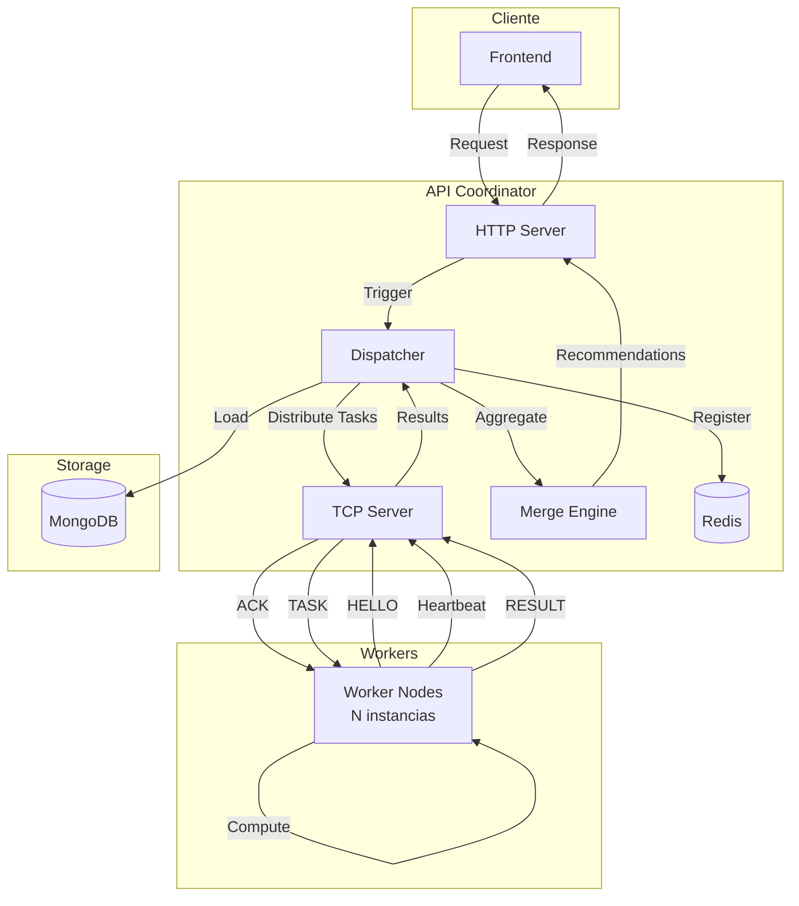

# GoFlix - Sistema Distribuido de Recomendación de Películas

## Tabla de Contenidos
1. [Descripción General](#descripción-general)
2. [Arquitectura del Sistema](#arquitectura-del-sistema)
3. [Componentes Principales](#componentes-principales)
4. [API Endpoints](#api-endpoints)
5. [Flujo de Trabajo](#flujo-de-trabajo)
6. [Tecnologías Utilizadas](#tecnologías-utilizadas)
7. [Despliegue](#despliegue)
8. [Monitoreo y Salud del Sistema](#monitoreo-y-salud-del-sistema)

---

## Descripción General

**GoFlix** es un sistema distribuido de recomendación de películas construido en Go que utiliza algoritmos de filtrado colaborativo para generar recomendaciones personalizadas. El sistema está diseñado para escalar horizontalmente mediante la distribución de cálculos intensivos a múltiples nodos worker, permitiendo procesar grandes volúmenes de datos de manera eficiente.

### Características Principales

- **Recomendaciones Personalizadas**: Basadas en el historial de calificaciones del usuario
- **Películas Populares**: Top 10 películas más vistas/mejor calificadas globalmente
- **Estadísticas de Usuario**: Películas vistas, géneros favoritos
- **Arquitectura Distribuida**: Escalable horizontalmente con múltiples workers
- **Autenticación JWT**: Sistema seguro de login/registro
- **Monitoreo en Tiempo Real**: Estado del sistema, workers, y recursos
- **Health Checks**: Verificación de servicios críticos

---

## Arquitectura del Sistema

El sistema sigue una arquitectura **Coordinator-Worker** con los siguientes componentes:



### Flujo de Datos

1. **Cliente → API Coordinator**: El frontend envía una solicitud HTTP de recomendación
2. **HTTP Server → Dispatcher**: El servidor HTTP activa el dispatcher
3. **Dispatcher → MongoDB**: Carga los datos de calificaciones de usuarios
4. **Dispatcher → Workers**: Distribuye tareas de cálculo entre workers disponibles
5. **Workers → Cálculo**: Cada worker calcula similitudes para su partición de datos
6. **Workers → Dispatcher**: Envían resultados parciales
7. **Dispatcher → Merge**: Agrega y ordena todos los resultados
8. **API → Cliente**: Retorna las recomendaciones finales

---

## Componentes Principales

### 1. API Coordinator (`api-coordinator/`)

El coordinador central que orquesta todo el sistema.

#### Módulos Internos

##### **Auth (`internal/auth/`)**
- **Propósito**: Gestión de autenticación y autorización
- **Funcionalidades**:
  - Registro de usuarios con hash de contraseñas (bcrypt)
  - Login con generación de tokens JWT
  - Middleware de autenticación para rutas protegidas
  - Almacenamiento en MongoDB
- **Componentes**:
  - `service.go`: Lógica de negocio de autenticación
  - `handler.go`: Endpoints HTTP
  - `repository.go`: Acceso a datos en MongoDB
  - `middleware.go`: Validación de tokens JWT
  - `token.go`: Generación y validación de JWT

##### **Recommend (`internal/recommend/`)**
- **Propósito**: Sistema de recomendaciones
- **Funcionalidades**:
  - Recomendaciones personalizadas basadas en usuario
  - Top 10 películas populares globales
  - Integración con workers para cálculos distribuidos
- **Componentes**:
  - `service.go`: Lógica de recomendación
  - `handler.go`: Endpoints de recomendación
  - `repository.go`: Consultas a MongoDB para películas populares

##### **UserStats (`internal/userstats/`)**
- **Propósito**: Estadísticas y perfil de usuario
- **Funcionalidades**:
  - Películas vistas por el usuario
  - Top 5 géneros favoritos
  - Calificaciones del usuario
- **Componentes**:
  - `service.go`: Lógica de estadísticas
  - `handler.go`: Endpoints de estadísticas
  - `repository.go`: Consultas agregadas en MongoDB

##### **Health (`internal/health/`)**
- **Propósito**: Health checks del sistema
- **Funcionalidades**:
  - Estado de MongoDB (ping)
  - Estado del servidor TCP
  - Conteo de workers conectados
- **Componentes**:
  - `health.go`: Service y handler de health check

##### **Monitoring (`internal/monitoring/`)**
- **Propósito**: Monitoreo detallado del sistema
- **Funcionalidades**:
  - **Estado de Servicios**: MongoDB, TCP Server
  - **Workers**: ID, estado (busy/idle), última conexión, IP
  - **Recursos del Proceso**: Goroutines, memoria (Alloc, Sys), GC
  - **Recursos del Sistema**: RAM total/disponible, núcleos CPU, uso por core, temperatura CPU
- **Tecnologías**: `gopsutil/v3` para métricas del sistema
- **Componentes**:
  - `monitoring.go`: Service y handler de monitoreo

##### **Server (`internal/server/`)**

###### **TCP Server (`server/tcp/`)**
- **Propósito**: Gestión de conexiones con workers
- **Funcionalidades**:
  - Aceptar conexiones de workers
  - Handshake y registro de workers
  - Envío de tareas (TASK messages)
  - Recepción de resultados (RESULT messages)
  - Heartbeats para monitoreo de workers
  - Registro en Redis de workers activos
- **Protocolo**: TCP con mensajes JSON prefijados por longitud (4 bytes big-endian)
- **Componentes**:
  - `server.go`: Lógica del servidor TCP

###### **HTTP Server (`server/http/`)**
- **Propósito**: API REST para clientes
- **Funcionalidades**:
  - Endpoints de autenticación
  - Endpoints de recomendación
  - Endpoints de estadísticas
  - Health checks y monitoreo
  - CORS habilitado
- **Framework**: Gin
- **Componentes**:
  - `httpserver.go`: Configuración de rutas y middleware

###### **Dispatcher (`server/dispatcher/`)**
- **Propósito**: Distribución de tareas entre workers
- **Funcionalidades**:
  - Particionamiento de datos de usuarios
  - Asignación de tareas a workers idle
  - Recolección de resultados parciales
  - Timeout de tareas (configurable)
  - Gestión de estado de workers (idle/busy)
- **Algoritmo**: Divide usuarios en N bloques (N = workers idle)
- **Componentes**:
  - `dispatcher.go`: Lógica de distribución

##### **Data (`internal/data/`)**
- **Propósito**: Carga de datos
- **Funcionalidades**:
  - Carga de calificaciones desde MongoDB
  - Carga de calificaciones desde CSV (legacy)
  - Normalización de datos
- **Componentes**:
  - `loader.go`: Funciones de carga de datos

##### **Platform (`internal/plattform/`)**
- **Propósito**: Servicios de infraestructura
- **Funcionalidades**:
  - Cliente MongoDB con retry automático
  - Cliente Redis para caché
  - Operaciones CRUD en MongoDB
- **Componentes**:
  - `mongo_service.go`: Wrapper de MongoDB
  - `redis_conn.go`: Conexión a Redis

### 2. Worker Node (`worker-node/`)

Nodos de cómputo que ejecutan algoritmos de recomendación.

#### Funcionalidades
- Conexión al TCP Server del coordinador
- Recepción de tareas de cálculo
- Cálculo de similitud entre usuarios (cosine similarity)
- Envío de resultados parciales
- Heartbeats periódicos

#### Algoritmo de Recomendación
- **Tipo**: User-based Collaborative Filtering
- **Métrica de Similitud**: Cosine Similarity
- **Proceso**:
  1. Recibe usuario objetivo y conjunto de candidatos
  2. Calcula similitud entre usuario objetivo y cada candidato
  3. Identifica top-K vecinos más similares
  4. Retorna lista de vecinos ordenados por similitud

### 3. Data Loader (`movie_lens_data_procc/`)

Servicio de inicialización que carga datos en MongoDB.

#### Funcionalidades
- Carga del dataset MovieLens a MongoDB
- Normalización de calificaciones
- Creación de índices
- Ejecución única al inicio del sistema

### 4. Frontend (`front_concurrente/`)

Interfaz web para usuarios finales.

#### Funcionalidades
- Login/Registro de usuarios
- Visualización de recomendaciones
- Exploración de películas populares
- Perfil de usuario con estadísticas
- Dashboard de monitoreo del sistema

---

## API Endpoints

### Autenticación

#### `POST /register`
Registra un nuevo usuario.

**Request Body:**
```json
{
  "email": "user@example.com",
  "password": "securepassword"
}
```

**Response:**
```json
{
  "user_id": "507f1f77bcf86cd799439011",
  "token": "eyJhbGciOiJIUzI1NiIs..."
}
```

#### `POST /login`
Autentica un usuario existente.

**Request Body:**
```json
{
  "email": "user@example.com",
  "password": "securepassword"
}
```

**Response:**
```json
{
  "user_id": "507f1f77bcf86cd799439011",
  "token": "eyJhbGciOiJIUzI1NiIs..."
}
```

### Recomendaciones (Protegidas)

#### `POST /recomend` o `POST /api/recomend`
Obtiene recomendaciones personalizadas para un usuario.

**Headers:**
```
Authorization: Bearer <token>
```

**Request Body:**
```json
{
  "user_id": 123,
  "top_n": 10
}
```

**Response:**
```json
{
  "recommendations": [
    {
      "id": "456",
      "similarity": 0.95
    },
    {
      "id": "789",
      "similarity": 0.92
    }
  ]
}
```

#### `GET /recomend/popular` o `GET /api/recomend/popular`
Obtiene las 10 películas más populares.

**Headers:**
```
Authorization: Bearer <token>
```

**Query Parameters:**
- `top_n` (opcional): Número de películas (default: 10)

**Response:**
```json
{
  "movies": [
    {
      "movieId": 318,
      "title": "The Shawshank Redemption (1994)",
      "genres": ["Crime", "Drama"],
      "rating": 4.5,
      "views": 15234
    }
  ]
}
```

### Estadísticas de Usuario (Protegidas)

#### `GET /api/user/stats`
Obtiene estadísticas del usuario autenticado.

**Headers:**
```
Authorization: Bearer <token>
```

**Response:**
```json
{
  "movies_seen": [
    {
      "movieId": 1,
      "title": "Toy Story (1995)",
      "genres": ["Animation", "Children's", "Comedy"],
      "rating": 4.0
    }
  ],
  "top_genres": [
    {
      "genre": "Drama",
      "count": 45
    },
    {
      "genre": "Comedy",
      "count": 32
    }
  ]
}
```

### Health Check (Pública)

#### `GET /health` o `GET /api/health`
Verifica el estado de los servicios críticos.

**Response:**
```json
{
  "status": "ok",
  "timestamp": "2025-12-04T22:21:04Z",
  "services": {
    "mongodb": {
      "status": "ok"
    },
    "tcp_server": {
      "status": "ok",
      "worker_count": 2
    },
    "frontend": {
      "status": "unknown",
      "info": "check frontend URL directly"
    }
  }
}
```

### Monitoreo (Pública)

#### `GET /api/monitoring`
Obtiene información detallada del sistema.

**Response:**
```json
{
  "timestamp": "2025-12-04T22:21:04Z",
  "mongodb": "ok",
  "tcp_server": "running",
  "workers": [
    {
      "id": "d7713fcf-c537-4ff8-939b-b3c6628eec6f",
      "state": 0,
      "last_seen": "2025-12-04T22:21:04Z",
      "ip": "172.19.0.7:60626"
    }
  ],
  "system": {
    "num_goroutine": 23,
    "alloc_bytes": 16311328,
    "sys_bytes": 38689808,
    "num_gc": 13,
    "total_ram": 16384458752,
    "available_ram": 7453532160,
    "used_ram_percent": 43.64,
    "total_cpu_cores": 12,
    "cpu_usage_percent": [26.22, 30.62, 35.14, ...],
    "cpu_temperatures": [
      {
        "sensorKey": "coretemp_package_id_0",
        "temperature": 54,
        "sensorHigh": 100,
        "sensorCritical": 100
      }
    ]
  }
}
```

---

## Flujo de Trabajo

### 1. Inicialización del Sistema

```
1. Docker Compose inicia todos los servicios
2. MongoDB se levanta
3. Data Loader carga el dataset MovieLens en MongoDB
4. Redis se inicializa
5. API Coordinator:
   - Inicia TCP Server (puerto 9000)
   - Inicia HTTP Server (puerto 80)
   - Carga datos de MongoDB en memoria
6. Workers se conectan al TCP Server
   - Envían mensaje HELLO
   - Reciben ACK con worker_id
   - Registrados en Redis
7. Frontend se levanta (puerto 5050)
```

### 2. Flujo de Recomendación

```
1. Usuario hace login → Recibe JWT token
2. Usuario solicita recomendaciones:
   POST /api/recomend
   Headers: Authorization: Bearer <token>
   Body: { "user_id": 123, "top_n": 10 }

3. HTTP Server valida token JWT
4. Dispatcher:
   - Identifica workers idle
   - Particiona usuarios en N bloques
   - Crea tareas para cada worker
   - Envía TASK messages vía TCP

5. Workers:
   - Reciben tarea con usuario objetivo y candidatos
   - Calculan similitud coseno
   - Identifican top-K vecinos
   - Envían RESULT message

6. Dispatcher:
   - Recolecta resultados parciales
   - Agrega y ordena por similitud
   - Retorna top-N recomendaciones

7. HTTP Server responde al cliente con recomendaciones
```

### 3. Flujo de Películas Populares

```
1. Usuario solicita películas populares:
   GET /api/recomend/popular?top_n=10
   Headers: Authorization: Bearer <token>

2. HTTP Server valida token JWT
3. Repository ejecuta agregación en MongoDB:
   - Cuenta vistas por película (número de ratings)
   - Calcula rating promedio
   - Ordena por vistas descendente
   - Limita a top_n
   - Hace lookup de detalles de película

4. HTTP Server responde con lista de películas
```

### 4. Monitoreo Continuo

```
1. Workers envían heartbeats cada X segundos
2. TCP Server actualiza last_seen de cada worker
3. Endpoint /api/monitoring consulta:
   - Estado de MongoDB (ping)
   - Lista de workers y su estado
   - Métricas del sistema (CPU, RAM, temperatura)
4. Frontend puede mostrar dashboard en tiempo real
```

---

## Tecnologías Utilizadas

### Backend
- **Lenguaje**: Go 1.23
- **Framework Web**: Gin
- **Base de Datos**: MongoDB 6.0
- **Caché**: Redis 7
- **Autenticación**: JWT (golang-jwt/jwt/v5)
- **Hashing**: bcrypt (golang.org/x/crypto)
- **Monitoreo**: gopsutil/v3

### Frontend
- **Framework**: (Especificar según front_concurrente)
- **Puerto**: 5050

### Infraestructura
- **Containerización**: Docker
- **Orquestación**: Docker Compose
- **Networking**: Red interna Docker

### Protocolos
- **HTTP/REST**: Comunicación cliente-servidor
- **TCP**: Comunicación coordinador-workers
- **JSON**: Formato de mensajes

---

## Despliegue

### Requisitos Previos
- Docker
- Docker Compose
- Dataset MovieLens (en `./dataset/`)

### Variables de Entorno

#### API Coordinator (`deploy/env/api.env`)
```env
# MongoDB
MONGODB_URI=mongodb://mongo:27017
MONGO_DB_NAME=goflix
MONGO_COLL_NAME=user-movie-matrix

# JWT
JWT_SECRET=your-secret-key-here

# TCP Server
WORKER_TCP_ADDR=:9000

# HTTP Server
HTTP_ADDR=:80

# Dispatcher
DISPATCHER_RESULT_TIMEOUT=90s

# MongoDB Retry
MONGO_RETRY_INTERVAL=15s
MONGO_MAX_RETRIES=10
```

#### Workers (`deploy/env/worker.env`)
```env
COORDINATOR_ADDR=api:9000
WORKER_CONCURRENCY=4
HEARTBEAT_INTERVAL=10s
```

### Comandos de Despliegue

```bash
# Clonar repositorio
git clone <repo-url>
cd tf

# Construir e iniciar servicios
docker-compose up --build

# Servicios disponibles:
# - API: http://localhost:8000
# - Frontend: http://localhost:5050
# - MongoDB: localhost:27017
# - TCP Server: localhost:9080
```

### Escalado de Workers

```bash
# Escalar a 5 workers
docker-compose up --scale worker1=5 -d
```

### Logs

```bash
# Ver logs de todos los servicios
docker-compose logs -f

# Ver logs de un servicio específico
docker-compose logs -f api
docker-compose logs -f worker1
```

---

## Monitoreo y Salud del Sistema

### Health Check
- **Endpoint**: `GET /health`
- **Propósito**: Verificación rápida de servicios críticos
- **Uso**: Load balancers, orquestadores

### Monitoring
- **Endpoint**: `GET /api/monitoring`
- **Propósito**: Métricas detalladas para dashboards
- **Métricas**:
  - Estado de servicios (MongoDB, TCP)
  - Workers activos y su estado
  - Recursos del proceso (memoria, goroutines)
  - Recursos del sistema (CPU, RAM, temperatura)

### Redis
- **Propósito**: Registro de workers activos
- **Datos almacenados**:
  - Worker ID
  - Concurrencia
  - Estado
  - Última conexión
  - Dirección IP
- **TTL**: 5 minutos

---

## Algoritmo de Recomendación

### User-Based Collaborative Filtering

El sistema utiliza filtrado colaborativo basado en usuarios con similitud coseno.

#### Fórmula de Similitud Coseno

```
similarity(u, v) = (Ru · Rv) / (||Ru|| × ||Rv||)
```

Donde:
- `Ru` = Vector de calificaciones del usuario u
- `Rv` = Vector de calificaciones del usuario v
- `·` = Producto punto
- `||R||` = Norma euclidiana del vector

#### Proceso de Recomendación

1. **Entrada**: Usuario objetivo U, conjunto de candidatos C, top-N
2. **Cálculo de Similitud**: Para cada candidato c en C, calcular similarity(U, c)
3. **Selección de Vecinos**: Ordenar candidatos por similitud descendente
4. **Top-K Vecinos**: Seleccionar los K usuarios más similares
5. **Generación de Recomendaciones**: Agregar películas de los vecinos que U no ha visto
6. **Salida**: Lista de películas recomendadas ordenadas por relevancia

#### Optimizaciones
- **Particionamiento**: Divide candidatos entre workers para paralelización
- **Normalización**: Calificaciones normalizadas para mejor comparación
- **Caché**: Resultados parciales en Redis (futuro)

---

## Estructura del Proyecto

```
tf/
├── api-coordinator/          # Coordinador central
│   ├── cmd/api/             # Punto de entrada
│   ├── internal/            # Módulos internos
│   │   ├── auth/           # Autenticación
│   │   ├── recommend/      # Recomendaciones
│   │   ├── userstats/      # Estadísticas
│   │   ├── health/         # Health checks
│   │   ├── monitoring/     # Monitoreo
│   │   ├── server/         # Servidores TCP/HTTP
│   │   ├── data/           # Carga de datos
│   │   └── plattform/      # Servicios de infraestructura
│   └── Dockerfile
├── worker-node/             # Nodos de cómputo
│   ├── cmd/worker/
│   ├── internal/
│   └── Dockerfile
├── movie_lens_data_procc/   # Cargador de datos
│   └── Dockerfile
├── front_concurrente/       # Frontend
│   └── Dockerfile
├── pkg/                     # Paquetes compartidos
│   ├── types/              # Tipos de datos
│   ├── tcp/                # Utilidades TCP
│   └── styles/             # Estilos de logging
├── dataset/                 # Dataset MovieLens
├── deploy/env/              # Variables de entorno
├── docker-compose.yml       # Orquestación
└── go.mod                   # Dependencias Go
```

---

## Conclusión

GoFlix es un sistema distribuido robusto y escalable para recomendaciones de películas que demuestra:
- Arquitectura de microservicios
- Computación distribuida
- Procesamiento paralelo
- Autenticación segura
- Monitoreo en tiempo real
- Escalabilidad horizontal

El sistema está diseñado para manejar grandes volúmenes de datos y usuarios concurrentes mediante la distribución eficiente de cálculos entre múltiples workers, manteniendo baja latencia y alta disponibilidad.
