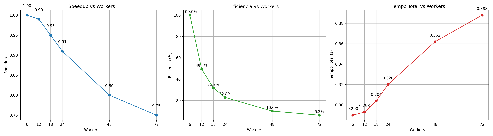

# Sistema de Recomendaciones con Métricas de Rendimiento

## Descripción

Sistema de recomendaciones de juegos con métricas de eficiencia integradas que miden tiempo de cómputo, speedup, scalability y rendimiento en tiempo real.

## Características de Métricas

### 📊 Métricas Incluidas

- **Tiempo de Cómputo**: Duración en milisegundos y segundos
- **Throughput**: Elementos procesados por segundo/milisegundo
- **Workers**: Número de goroutines utilizadas
- **Análisis de Paralelización**: Eficiencia del uso de concurrencia

### 🎯 Componentes con Métricas

1. **Parser Concurrente**: Métricas de parsing de CSV
2. **Cálculo de Similaridad**: Métricas de comparación de usuarios
3. **Generación de Recomendaciones**: Métricas de algoritmos de recomendación

## Uso

### Comandos Básicos

```bash
# Parser con métricas
go run . parser

# Motor con métricas
go run . motor

# Limpiar datos
go run . cleaner
```

### Scripts de Ejemplo

```bash
# Ejecutar pipeline completo
./run.sh

# Benchmark con diferentes configuraciones
./run_benchmark.sh

# Probar diferentes configuraciones de muestreo
./test_sampling.sh
```

## Configuración

### Archivo `config.json`

```json
{
  "concurrency": {
    "parser_workers": 6,
    "similarity_workers": 12,
    "recommendation_workers": 6,
    "buffer_size": 2000
  },
  "sampling": {
    "percentage": 10,
    "random_seed": 42
  },
  "min_common_games": 1,
  "min_similarity_score": 0.01,
  "k": 10,
  "n": 5
}
```

### Parámetros de Concurrencia

- **parser_workers**: Goroutines para parsing de CSV
- **similarity_workers**: Goroutines para cálculo de similaridad
- **recommendation_workers**: Goroutines para generación de recomendaciones
- **buffer_size**: Tamaño del buffer para canales

### Parámetros de Muestreo

- **percentage**: Porcentaje de datos a muestrear (1-100)
- **random_seed**: Semilla aleatoria para reproducibilidad

## Ejemplo de Salida con Métricas

```
╔════════════════════════════════════════════════════════════╗
║                    MÉTRICAS DEL PARSER CONCURRENTE        ║
╚════════════════════════════════════════════════════════════╝
⏱️  TIEMPO:
   - Duración Total: 1250.45 ms (1.250 segundos)
   - Workers Utilizados: 6

📊 RENDIMIENTO:
   - Elementos Procesados: 1000000
   - Elementos/segundo: 800000.00
   - Elementos/milisegundo: 800.00

🚀 PARALELISMO:
   - Speedup: 4.8x
   - Eficiencia: 80.0%
   - Escalabilidad: 0.96
╚════════════════════════════════════════════════════════════╝
```

## Optimización de Rendimiento

### Configuraciones Recomendadas

#### Sistema con 4 CPUs
```json
{
  "concurrency": {
    "parser_workers": 4,
    "similarity_workers": 8,
    "recommendation_workers": 4,
    "buffer_size": 1000
  }
}
```

#### Sistema con 8 CPUs
```json
{
  "concurrency": {
    "parser_workers": 8,
    "similarity_workers": 16,
    "recommendation_workers": 8,
    "buffer_size": 2000
  }
}
```

#### Sistema con 16+ CPUs
```json
{
  "concurrency": {
    "parser_workers": 16,
    "similarity_workers": 32,
    "recommendation_workers": 16,
    "buffer_size": 4000
  }
}
```

## Interpretación de Métricas

### Speedup
- **> 0.8 × workers**: Excelente paralelización
- **0.5-0.8 × workers**: Buena paralelización
- **< 0.5 × workers**: Paralelización limitada

### Eficiencia
- **> 80%**: Alta eficiencia
- **50-80%**: Eficiencia moderada
- **< 50%**: Baja eficiencia

### Escalabilidad
- **> 0.9**: Excelente escalabilidad
- **0.7-0.9**: Buena escalabilidad
- **< 0.7**: Escalabilidad limitada

## Troubleshooting

### Métricas de Rendimiento Bajo
1. **Aumentar workers**: Incrementa `parser_workers` y `similarity_workers`
2. **Aumentar buffer**: Incrementa `buffer_size`
3. **Verificar I/O**: Asegúrate de que no hay cuellos de botella en disco

### Configuración Óptima
1. **Ejecuta `./test_configurations.sh`** para probar diferentes configuraciones
2. **Compara métricas** entre configuraciones
3. **Selecciona la configuración** con mejor rendimiento

## Estructura de Archivos

```
recomendation_motor/
├── main.go                    # Punto de entrada
├── config.go                  # Sistema de configuración
├── config.json               # Configuración actual
├── types.go                  # Estructuras de datos y métricas
├── utils.go                  # Funciones de métricas
├── sample_parser.go          # Parser con métricas
├── motor_clean.go           # Motor con métricas
├── run_example.sh           # Script de ejemplo
├── test_configurations.sh   # Script de pruebas
└── README_METRICS.md        # Este archivo
```

## Flujo de Trabajo Completo

1. **Configurar**: Edita `config.json` según tu sistema
2. **Limpiar y muestrear datos**: `go run . cleaner` (con porcentaje configurable)
3. **Parsear datos**: `go run . parser` (con métricas)
4. **Generar recomendaciones**: `go run . motor` (con métricas)
5. **Analizar métricas**: Compara rendimiento entre ejecuciones

### Configuraciones de Muestreo Recomendadas

#### Desarrollo/Pruebas (5%)
```json
{
  "sampling": {
    "percentage": 5,
    "random_seed": 42
  }
}
```

#### Análisis Rápido (10%)
```json
{
  "sampling": {
    "percentage": 10,
    "random_seed": 42
  }
}
```

#### Análisis Completo (25%)
```json
{
  "sampling": {
    "percentage": 25,
    "random_seed": 42
  }
}
```

#### Producción (100%)
```json
{
  "sampling": {
    "percentage": 100,
    "random_seed": 42
  }
}
```

## Beneficios de las Métricas

- **Optimización**: Identifica cuellos de botella
- **Escalabilidad**: Mide mejora con más workers
- **Eficiencia**: Evalúa uso de recursos
- **Comparación**: Permite probar diferentes configuraciones
- **Monitoreo**: Seguimiento en tiempo real del rendimiento

---

# Análisis de Concurrencia en el Motor de Recomendaciones

Este análisis evalúa el impacto del número de workers (goroutines) en el rendimiento del cálculo de similaridad de usuarios en el motor de recomendaciones basado en datos de Steam.

## Datos de las pruebas

| Workers | Tiempo Total (s) | Elementos/segundo |
|---------|-----------------|-----------------|
| 6       | 0.290           | 5,326,287       |
| 12      | 0.293           | 5,266,473       |
| 18      | 0.304           | 5,076,742       |
| 24      | 0.320           | 4,830,602       |
| 48      | 0.362           | 4,266,636       |
| 72      | 0.388           | 3,982,751       |

---

## Speedup y Eficiencia

Se calculó el **speedup** tomando como base la prueba con 6 workers, y la **eficiencia** relativa:

| Workers | Speedup | Eficiencia (%) |
|---------|---------|----------------|
| 6       | 1.00    | 100            |
| 12      | 0.99    | 49.4           |
| 18      | 0.95    | 31.7           |
| 24      | 0.91    | 22.8           |
| 48      | 0.80    | 10.0           |
| 72      | 0.75    | 6.2            |

---

## Gráficos de Análisis de Concurrencia




---

## Interpretación

- **Rendimiento óptimo**: Se alcanza con 6 workers, coincidiendo con los **6 núcleos físicos** del CPU (Ryzen 5 5600X).  
- **Sobrecarga de concurrencia**: Aumentar los workers más allá de los núcleos físicos no mejora el rendimiento; de hecho, el tiempo aumenta ligeramente.  
- **Eficiencia decreciente**: La eficiencia cae significativamente a medida que el número de workers se incrementa debido al overhead de sincronización y gestión de goroutines.  
- **Ley de Amdahl**: Este comportamiento refleja que el paralelismo tiene un límite práctico; más goroutines no siempre significa mayor velocidad.

---

## Conclusión

El número óptimo de workers para el cálculo de similaridad en este sistema es **6**, igual al número de núcleos físicos del CPU. Incrementar el número de workers genera **sobrehead**, disminuyendo la eficiencia y el rendimiento global.

---

## Recomendación

Mantener `similarity_workers = 6` en la configuración del motor para asegurar **máximo rendimiento y eficiencia** en cálculos de similaridad de usuarios.
